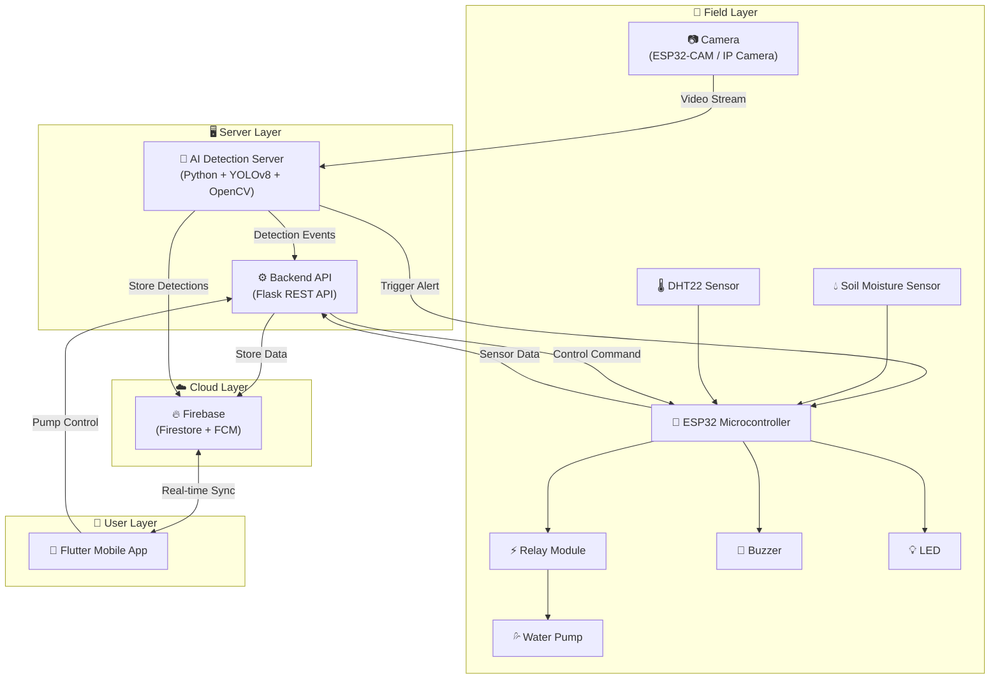

# 🌾 IoT-Based Crop Protection System and Method with AI-Driven Animal Detection and Water Management


---

## 📖 Project Overview

The **IoT-Based Crop Protection System** is an intelligent, integrated solution designed to safeguard agricultural fields from animal intrusion while optimizing water usage. By combining **Artificial Intelligence (YOLOv8)** for real-time animal detection with **Internet of Things (IoT)** sensors for environmental monitoring, this system provides a comprehensive smart farming ecosystem.

When an animal such as a wild boar, deer, monkey, or cattle is detected approaching the crops, the system instantly triggers safe, non-harmful deterrents (buzzer and LED), saves the detection image with a timestamp, and sends real-time alerts to the farmer's mobile phone via a Flutter application and Firebase Cloud Messaging.

Simultaneously, soil moisture, temperature, and humidity data are continuously monitored by ESP32-based IoT sensors. The system automatically controls a water pump based on soil moisture thresholds, ensuring optimal irrigation, preventing water wastage, and promoting crop health. All data is stored in Firebase Firestore for historical analysis and trend visualization.

---

## ✨ Key Features

- 🎯 **AI-Powered Animal Detection** — YOLOv8 with OpenCV for real-time identification of wild animals
- 🔔 **Automated Deterrents** — Buzzer and LED activation upon animal detection (non-harmful)
- 📱 **Mobile Dashboard** — Cross-platform Flutter app with real-time sensor data and alerts
- 💧 **Smart Irrigation** — Automated pump control based on soil moisture thresholds
- 🌡️ **Environmental Monitoring** — DHT22 temperature/humidity + soil moisture sensing
- ☁️ **Cloud Integration** — Firebase Firestore for data storage and FCM for push notifications
- 📊 **Historical Analytics** — Sensor trend charts and detection history logs
- 🔄 **Remote Control** — Manual/Auto pump control from the mobile app
- 📸 **Detection Snapshots** — Auto-saved images with bounding boxes and timestamps

---

## 🏗️ System Architecture



---

## 🛠️ Technologies Used

### Hardware

| Component | Specification | Purpose |
|-----------|--------------|---------|
| ESP32 DevKit V1 | Dual-core, Wi-Fi + BLE | Main IoT microcontroller |
| ESP32-CAM / RPi Camera | OV2640 / Camera Module v2 | Animal detection camera |
| DHT22 Sensor | -40°C to 80°C, 0-100% RH | Temperature & humidity monitoring |
| Soil Moisture Sensor | Capacitive v1.2 | Soil moisture measurement |
| Relay Module | 5V, Single Channel | Water pump control |
| Water Pump | 5V DC Submersible | Automated irrigation |
| Buzzer | Active, 5V | Animal deterrent (sound) |
| LED | Red/Green, 5mm | Animal deterrent (light) |

### Software

| Technology | Version | Purpose |
|-----------|---------|---------|
| Python | 3.8+ | AI detection & backend |
| YOLOv8 (Ultralytics) | Latest | Object detection model |
| OpenCV | 4.8+ | Computer vision processing |
| Flask | 3.0+ | REST API backend |
| Flutter | 3.0+ | Cross-platform mobile app |
| Dart | 3.0+ | Flutter programming language |
| Firebase Firestore | Latest | Cloud database |
| Firebase Cloud Messaging | Latest | Push notifications |
| Arduino IDE | 2.0+ | ESP32 firmware development |

---

## 📁 Project Folder Structure

```text
iot-crop-protection-ai/
├── README.md                          # Project documentation
├── .gitignore                         # Git ignore rules
├── LICENSE                            # MIT License
│
├── ai-animal-detection/               # 🧠 AI Detection Module
│   ├── detection.py                   # YOLOv8 + OpenCV detection script
│   ├── requirements.txt               # Python dependencies
│   └── README.md                      # Module documentation
│
├── esp32/                             # 🔧 ESP32 IoT Module
│   └── crop_protection.ino            # Arduino firmware
│
├── backend/                           # ⚙️ Backend API Module
│   ├── app.py                         # Flask REST API server
│   ├── requirements.txt               # Python dependencies
│   └── README.md                      # Module documentation
│
├── flutter-app/                       # 📱 Flutter Mobile App
│   ├── lib/
│   │   ├── main.dart                  # App entry point
│   │   ├── models/
│   │   │   ├── sensor_data.dart       # Sensor data model
│   │   │   └── detection.dart         # Detection data model
│   │   ├── screens/
│   │   │   ├── home_screen.dart       # Dashboard screen
│   │   │   ├── detection_history_screen.dart
│   │   │   └── sensor_history_screen.dart
│   │   ├── widgets/
│   │   │   ├── sensor_card.dart       # Reusable sensor card
│   │   │   ├── detection_alert_card.dart
│   │   │   └── pump_control_card.dart
│   │   └── services/
│   │       ├── firebase_service.dart  # Firebase integration
│   │       └── api_service.dart       # REST API client
│   ├── pubspec.yaml                   # Flutter dependencies
│   └── README.md                      # Module documentation
│
└── docs/                              # 📚 Documentation
    ├── architecture.md                # System architecture & project report
    ├── flowchart.md                   # System flowcharts (Mermaid)
    └── circuit_connections.md         # Hardware wiring guide
```

---

## 📋 Prerequisites

Before setting up the project, ensure you have the following installed:

- [Python 3.8+](https://www.python.org/downloads/)
- [Arduino IDE 2.0+](https://www.arduino.cc/en/software) with ESP32 board support
- [Flutter SDK 3.0+](https://docs.flutter.dev/get-started/install)
- A [Firebase project](https://console.firebase.google.com/) with Firestore and FCM enabled
- USB cable for ESP32 programming
- Webcam or IP camera for animal detection

---

## 🚀 Installation & Setup

### 1. Clone the Repository

```bash
git clone https://github.com/ManasaLingam/iot-crop-protection-ai.git
cd iot-crop-protection-ai
```

### 2. AI Animal Detection (Python/YOLOv8)

```bash
cd ai-animal-detection
python -m venv venv
source venv/bin/activate        # On Windows: venv\Scripts\activate
pip install -r requirements.txt
```

Create a `.env` file:
```env
CAMERA_SOURCE=0                          # 0 for webcam, or RTSP/HTTP URL
FIREBASE_CREDENTIALS_PATH=path/to/firebase-adminsdk.json
BACKEND_API_URL=http://localhost:5000/api/detection
ESP32_IP=192.168.1.100
CONFIDENCE_THRESHOLD=0.5
DETECTION_COOLDOWN=30
```

### 3. ESP32 Firmware (Arduino IDE)

1. Open `esp32/crop_protection.ino` in Arduino IDE
2. Install required libraries via Library Manager:
   - `DHT sensor library` by Adafruit
   - `ArduinoJson` by Benoît Blanchon
3. Update Wi-Fi credentials and server URLs in the configuration section
4. Select board: `ESP32 Dev Module`
5. Compile and upload

### 4. Backend Server (Flask)

```bash
cd backend
python -m venv venv
source venv/bin/activate        # On Windows: venv\Scripts\activate
pip install -r requirements.txt
```

Create a `.env` file:
```env
FIREBASE_CREDENTIALS_PATH=firebase-adminsdk.json
ESP32_IP=http://192.168.1.100
FLASK_PORT=5000
```

### 5. Flutter Mobile App

```bash
cd flutter-app
flutter pub get
```

- Add `google-services.json` (Android) to `android/app/`
- Add `GoogleService-Info.plist` (iOS) to `ios/Runner/`

```bash
flutter run
```

---

## 🏃 How to Run

1. **🔌 Power up Hardware** — Connect ESP32 with sensors, ensure Wi-Fi connectivity
2. **⚙️ Start Backend** — `cd backend && python app.py`
3. **🧠 Start AI Detection** — `cd ai-animal-detection && python detection.py`
4. **📱 Launch App** — `cd flutter-app && flutter run`

The system will begin monitoring automatically. Animal detections trigger alerts, and sensor data flows to the dashboard in real-time.

---

## 🔌 Circuit Diagram

For detailed wiring instructions, pin mappings, and component connections, refer to:

📄 [Circuit Connections Guide](docs/circuit_connections.md)

---

## 📸 Screenshots

| Dashboard | Detection Alert | Sensor History |
|:---------:|:--------------:|:--------------:|
| *Dashboard with real-time sensor cards* | *Animal detection alert notification* | *Historical sensor data charts* |

> 💡 Screenshots will be added after deployment on physical hardware.

---

## 📄 Documentation

- [System Architecture & Project Report](docs/architecture.md) — Abstract, objectives, algorithms, and academic documentation
- [System Flowcharts](docs/flowchart.md) — Mermaid-based flow diagrams
- [Circuit Connections](docs/circuit_connections.md) — Hardware wiring guide with pin mappings

---

## 🤝 Contributing

Contributions are welcome! Please follow these steps:

1. Fork the repository
2. Create a feature branch (`git checkout -b feature/AmazingFeature`)
3. Commit your changes (`git commit -m 'Add AmazingFeature'`)
4. Push to the branch (`git push origin feature/AmazingFeature`)
5. Open a Pull Request

---

## 📄 License

This project is licensed under the **MIT License** — see the [LICENSE](LICENSE) file for details.

---

## ✍️ Author

**Manasa Lingam**

Final-year Engineering Project — IoT-Based Crop Protection System with AI-Driven Animal Detection and Water Management

---

## 🙏 Acknowledgments

- [Ultralytics YOLOv8](https://github.com/ultralytics/ultralytics) — State-of-the-art object detection
- [Flutter](https://flutter.dev/) — Cross-platform mobile framework by Google
- [Firebase](https://firebase.google.com/) — Cloud backend services
- [OpenCV](https://opencv.org/) — Computer vision library
- [Arduino / ESP32](https://www.espressif.com/) — IoT hardware ecosystem
- Open-source community and academic research in smart agriculture
